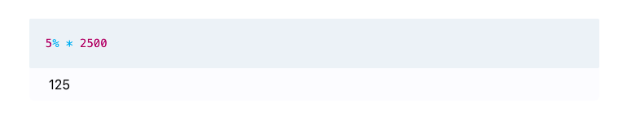

# The Model Block

The model block is the place for numbers, variables, formulas and models. You can add as many as you want to your notebook. The model block is composed of a query section and a result section. As soon as Deci detects a valid expression, a preview of the result appears in real time below the query. To exit the model block and go back to text mode, simply click outside of the block.

